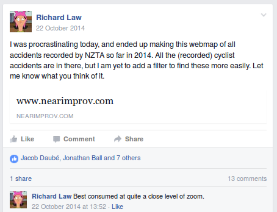
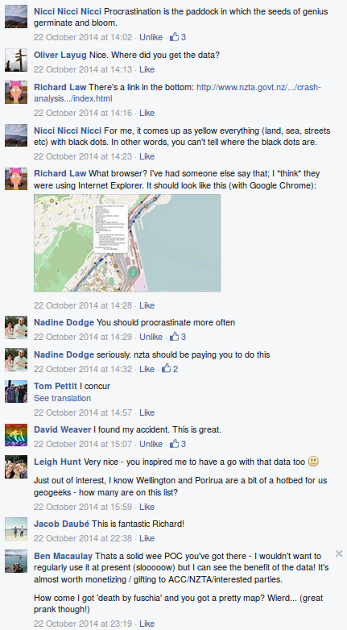
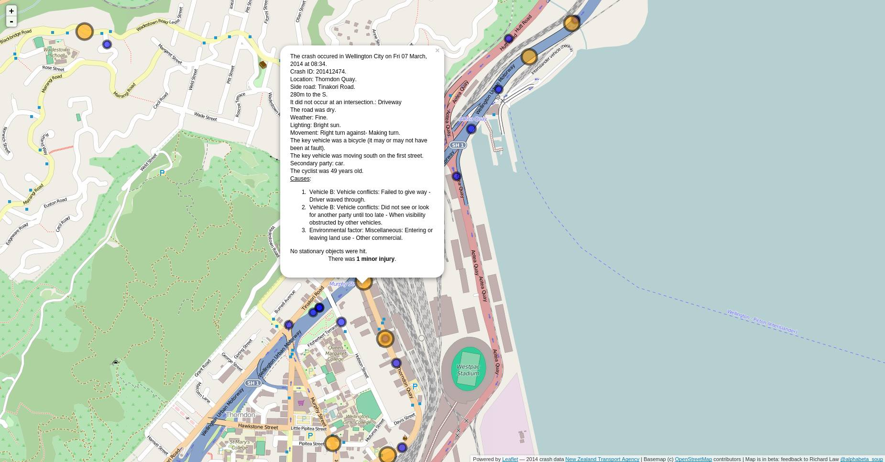
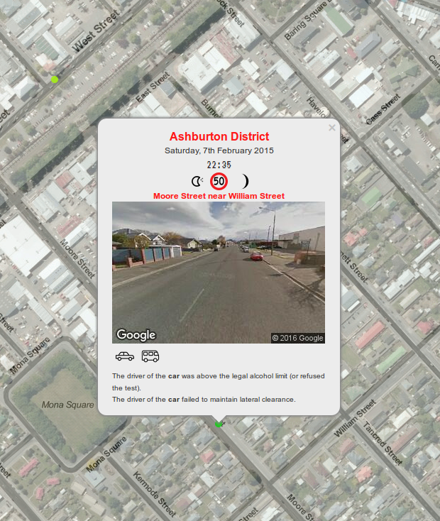
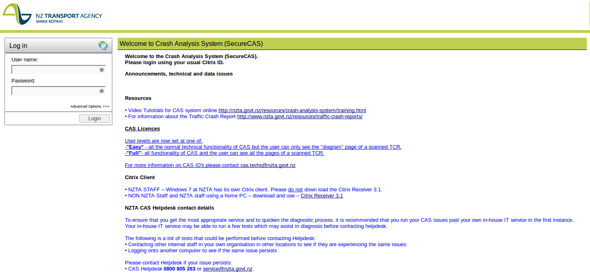
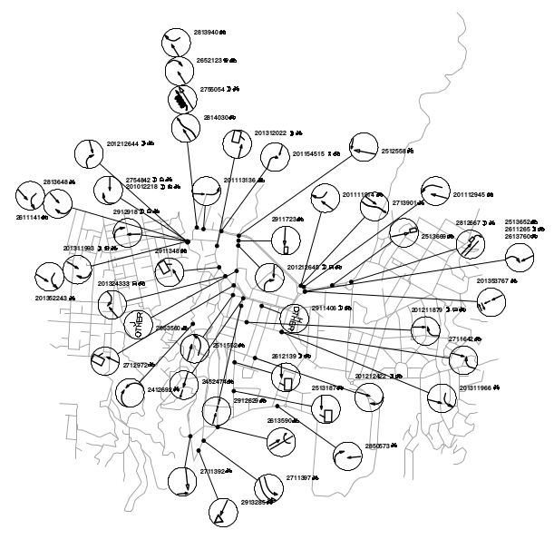

For several years, up until at least June 2015, the New Zealand Transport Agency (NZTA) published the data underlying their Crash Analysis System (CAS). This included information on every Police-attended road crash or accident in New Zealand, with attendant information on the environment it occurred in, and what was deemed to have contributed to the accident. While the method of publishing this data was primitive, it was sufficient for people with a little bit of time to spare (me) and an unhealthy obsession with transportation issues (me) to make use of it. While in many ways it was a good example of how not to do open data, at the very least it existed, so [other](http://www.statschat.org.nz/?s=foreign+drivers) [people](http://www.mixnmashentry.blogspot.co.nz/) could take it and run with it. All the NZTA had to do was sit back and watch, massage new data, and upload a new file every three months.

[[sidenote | What did it look like?]]
| It consisted of one CSV file for each calendar year, with each record in the file heavily encoded. Decoding required automation and a lot of sifting through several PDFs, and a tool to get machine-readable tables from them. An example record is:
|
| ```
| 'Ashburton District','MOORE ST','100','N',' ','WILLIAM ST','201531749','07/02/2015','Sat','2335','EA','CN1V','103A 129A ','M','R','D','DO','F ',' ',' ','C','050','0','0','0','','','1499510','5137544',
| ```
|
| Yes, that whitespace in `'F '` is actually meaningful.

# Rising Action

When I found this dataset one afternoon in 2014, I set to work making a prototype [map visualisation](http://www.nearimprov.com/national-crash-statistics/). My initial concern at the time was just trying to see the frequency of different type of accidents involving cyclists along my commute home between Wellington and Petone. I wanted to know this for my own curiosity and safety, but I also wanted to share it with members of the [Cycle Aware Wellington Facebook group](https://www.facebook.com/groups/166036183455868/), because I thought it would be useful to them.

The raw CAS data is useless by itself, so interested people in this group would not be able to use it. If I had to write some code to decode a portion of the CAS data for consumption by people, then I would have to be able to do it for every accident in the system. [So that's what I did](https://github.com/alpha-beta-soup/national-crash-statistics), very slowly, iteratively, while procrastinating from my university work, with the help of a friend.

Here's the first time I sent people to it:



It was buggy as Hell but seemed well-received, and I was inspired to keep working on it.



Here's how I first decoded the CAS records:



Here's how it's done [now](/national-crash-statistics/):



To get a sense of the utility of this kind of visualisation, note that the only other way to see this data decoded is to sign up for what I call the "NZTA Experience". Apparently the NZTA has heard of the Internet, but they make you download an additional program in order to use it... and ask that you please forward all queries to your hand-dandy in-house IT team.



The [training](/documents/cas/cas9-video.wmv) [videos](/documents/cas/cas12-video.wmv) are a little bit sad/funny. They give an insight into the *awesome UI* I was missing out on by not signing a license agreement and using their system to view a text file.

[[sidenote | Credit where it's due...]]
| There's a lot in that bloated interface that I wouldn't even attempt to implement. I'm sure it's useful for a number of use cases. It just would be great if it was possible to use it.

I took one look at this option before deciding it wasn't for me. I don't even know what a "Citrix Receiver 3.1" is, but apparently it's a Windows thing... NZTA, if you require people to have licenses for proprietary software to access open data, the data is not open.

I took the liberty of downloading the linked documents, for posterity. Here are links to them:

### [`CAS-Privacy-Agreement-v1.docx`](/documents/cas/CAS-Privacy-Agreement-v1.docx)

An MS Word privacy agreement that must be signed to use the NZTA's CAS viewer. ([PDF](/documents/cas/CAS-Privacy-Agreement-v1.pdf).) In particular, it stipulates that no-one can access or use CAS data unless they have been entitled to do so by the NZTA in writing. I figured that providing the data for download absolved me from this, and these statements were only to be found in relation to accessing the Citrix system. I was never told otherwise. There was no fee associated with using CAS.

This agreement includes this following *Purpose of collection of information* (emphasis added):

> All information collected for use in CAS is collected in order to obtain and analyse accurate data in respect of traffic crashes in New Zealand.  Analysis of the information allows **the NZTA**, **other government agencies**, and **agencies engaged in activities that contribute to the furtherance of road safety in New Zealand** to make significant contributions to crash prevention and wider road safety in New Zealand.  This includes contributing to the achievement of the Government policy objectives recorded in New Zealand’s Road Safety Strategy 2010-2020, Safer Journeys.

So it seems pretty clear that the CAS data is designed from the outset to exclude the wider public from being able to interpret the data.

It is also abundantly clear that the NZTA is preoccupied with the privacy risks associated with this data:

> **14.3**
>
> In particular the customer must do everything reasonably within its power to prevent any access, use or disclosure of the information other than that which is expressly provided for in this agreement, and will not, or allow a user to, further disclose any information unless the information is in a form in which individuals cannot be identified.

I can see why my map may have ruffled some feathers. I just hope they can see how unreasonable their access to CAS-the-system is, given how useful and important CAS-the-data is.

To my informal and naïve tastes, there's a considerable amount of legalse in this document, so I'd really appreciate any interpretations of it (leave a comment).

Finally, here's a gem:

> **13.1**
>
> The NZTA will make all reasonable endeavours to provide a secure and reliable system allowing the customer and user to use CAS at all times other than between 5pm and midnight each Saturday, such time being set aside for CAS maintenance.

### [`guide-to-coded-crash-reports.pdf`](/documents/cas/guide-to-coded-crash-reports.pdf)

My program uses the information in this PDF to decode the raw CSV data to a more meaningful GeoJSON structure, which then gets rendered in your browser. Go to page 15 to see the breakdown of the several hundred possible contributions to a crash. One crash can have as many of these explanations as needed; most explanations are additionally assigned to one of the parties to the crash, keyed by the type of vehicle, even working around the case where there are multiple vehicles of the same type in a crash. That's a pretty complex structure, and *kudos* for the NZTA for managing to cram that into a CSV!

### [`CASp24.pdf`](/documents/cas/CASp24.pdf)

A report prepared by Beca on some cycling project that includes images showing the NZTA's CAS interface as it stood.

### [`CASp27.pdf`](./documents/cas/CASp27.pdf)

A report prepared by OPUS on a cycling project in Wellington that includes an Appendix showing the use of CAS data, including an almost hieroglyphic map of the movements of parties involved in accidents in their case study area.



# Confrontation

Then, in 2015, the data stopped being updated. The last update was for the first three months of 2015, which was published in June that year. The next three months' of data was due in September, but never came. Then, the links to the old data—all 15.25 years of it—disappeared from the NZTA website in silence. Now, if you wanted to see the CAS data, you had no choice but to sign up for the NZTA Experience. Once there, you would not be able to tell people about any of the disaggregate information you have access to, per the terms of the agreement you have to sign.

Does that make sense to anyone? Let's run through what I make of the NZTA's thought process.

1. We are worried about the privacy implications of people looking at details of individual crashes.
2. To protect privacy while balancing the need for organisations to actually use this information, the NZTA Experience (*SecureCAS*) exists to allow people access to CAS only after signing an agreement that stipulates that you can't show other people disaggregate information.
3. Third party applications using the raw data that are not subject to the license agreement should be discouraged through the non-publication of the raw data, in order to protect privacy.
4. The data is still open; anyone can access the raw data, it just has to be through the NZTA Experience.

Right. So I (as a third-party developer) can't make a web application that displays the details of individual accidents to the public, but any individual member of the public can sign up for *SecureCAS*. **If privacy is the motivating force for the decision to not publish the raw data, what difference does it make if the public uses my application, or SecureCAS?** Ultimately, if someone wants disaggregate information, they can get it. I just made it easier. I made it so people attending a meeting of the Hutt Cycle Network can pull out a laptop and zoom to an area being discussed, and start using facts instead of perception.

[[sidenote | When I was a member of this group]]
| I was really happy to see people using it, and finding it easy to access information they didn't even know existed. I see the publication of the raw data as potentially addressing a power imbalance between the road controlling authorities, who have had knowledge of and access to SecureCAS for years, and Joe Public, who didn't even know this data was collected.

When I noticed that the data had not been updated, I sent the following email to the Statistical Analysis team at the NZTA asking for an explanation:

> **Richard**: I was looking to update my record of the CAS data, but the page I have used in the past no longer exists: [https://www.nzta.govt.nz/resources/crash-analysis-system-data/](https://www.nzta.govt.nz/resources/crash-analysis-system-data/)<br>
I noticed a few weeks ago that although it was up, the available data only went as far as March this year. Is this data still available for download?
>
> **NZTA**: Apologies for the delay in replying to your email. We are currently reviewing the CAS information we have available on our website to make sure it meets our privacy and security standards. As **the new on line data will be summarised information** and I understand you work with geospatial co-ordinates, would you like to apply for CAS access? This will give you access to the same level of information as was previously on the web.
>
> **Richard**: Yes I suppose I would like to apply for access, provided that the access will not cost me as I'm only using it as a hobbyist.<br>
However I'm using the CAS data to make a public web map ([http://www.nearimprov.com/national-crash-statistics/](http://www.nearimprov.com/national-crash-statistics/)) in collaboration with some others. **Will this review mean that my application will not be able to present the disaggregate information to the public?**
>
> **Richard** [after a week without a response]: Is there any information on this review available? I have some free time available over this summer I am planning to spend developing my mapping application, but I first need to know if the data will still be able to be made public via my application.
>
> **NZTA**: Thanks for your email. There is no cost associated with access to CAS, but you will be required to sign a data agreement. **Under this agreement you will only be able to make aggregated information (totals of 4 or more) available through your app. Would you like to proceed with getting CAS access?**

I got very confused at this point, by the definition of "access to CAS". I didn't want to touch *SecureCAS* with a ten-foot barge pole. I just wanted the raw data to work with on my own. There was still no explanation as to why it had been removed. To date, there appears to be no information on the NZTA website about any review into CAS, including whether any users of CAS data were consulted.

I had no plans to sign up to a restrictive license that would make my crash map next to useless for the applications I originally intended it for. **If I have to aggregate accidents to a minimum of four... I... how do you even do that?**

*No, seriously*. Take four accidents at random. One caused by a drunk driver at one in the morning, who hit a pole and was injured severely. One a year earlier at a nearby pedestrian crossing where a driver failed to yield and injured a pedestrian. Another involving a driver reversing from their driveway and hitting a child riding their bike, who later died from their injuries. Another a nose-to-tail caused by a driver actually stopping at a stop sign when the following driver expected them to treat it like a give way sign, but with no one injured. **How do you aggregate these?**

You could perhaps say how many accidents there were, and how many people were injured or killed in this area. But you can't even say which type of accident is most prevalent, because they're all different and you're not allowed to discuss them in isolation. What if the council is proposing to remove the pedestrian crossing because (they argue) it is dangerous? What use is the aggregate data now? If only you could drill down into the raw data and extract that one accident that occurred on a pedestrian crossing and see why it happened!

What if fewer than four accidents even occurred in your suburb or town? Is it even possible to draw this on a map? Can the NZTA actually provide a concrete précis of what this aggregation is supposed to look like?

**The requirement for aggregation of CAS data in third-party applications completely shuts down the utility of the CAS data, and is extremely difficult to comply with.**

Continuing the email chain, after I essentially told them the above:

> **NZTA**:  Thanks for your interest in safety data. We are in the process of making a new aggregated CAS data set freely available using the Government’s Open Data initiative. This is the data set that will be publically available from now on without the signing of an agreement. This is the data set you could use for your personal mapping tool.
>
> **If someone wishes to obtain data in addition to that made available to the general public via the open data initiative, they will be required to sign a data agreement to place some conditions on how the data may be used, in order to ensure data is kept appropriately secure and to protect the privacy of those individuals represented in the data set. For example, you would be able to use the data for research purposes and publish the results in an aggregated form.**
> I understand, however, that you would like data variables over and above the data that we will be making available via the government open data initiative or that has been published in the past. The way in which we can make certain additional variables available to you is by providing you with CAS access so that you can extract the additional data yourself, however, you will be required to sign a data agreement which places certain conditions on how you may use the data.
> There is no cost associated with access to the CAS data base.
>
> Please let me know if you wish to discuss.

Here's my take on the embiggend section of that quote:

*Third party applications cannot show disaggregate information because privacy. If someone wants to see the apparently private information, they sure can, they just have to use SecureCAS.*

Frankly, this makes no sense whatsoever. All it achieves is putting up a barrier to people making use of the data. I replied to the email:

> **Richard**: Thank you so much for the clarification about accessing the CAS data.
>
>Is there any documentation about the review into CAS that I may read? My application is predicated on disaggregated data. I'd like to contest that there are valid privacy concerns with the use of the data as it currently stands, and also note that if aggregated, the data is not going to be useful for most of the applications I see for it.
>
> For example, if required to aggregate to at least four accidents (as previously stated), after I apply multiple filters (e.g. accidents involving pedestrians at a particular pedestrian crossing in Petone 2000-2015 — as I did recently for the Hutt Cycle Network), the number of relevant accidents falls below this number and my map is then no longer useful as an advocacy tool for commenting on highly-local road network changes (a proposed change to the location of the crossing). I can imagine hundreds of possible permutations of the data just like this. If I am only able to show aggregate information, the function of the map will be restricted to commenting on general trends only (e.g. there were x accidents on pedestrian crossings across all of Lower Hutt... but I can't say where or why exactly). I believe this to be a considerable regression in the utility of the data.
>
> I disagree that there are major privacy concerns that justify changing the service in this way. To the extent that I may be wrong or overruled, I propose that there are better ways of addressing these concerns than requiring aggregation (for example, only specifying an approximate date, or randomising the location slightly, or suppressing the reporting of specific accident codes).
>
> Has there been consultation with the users of the data before these changes were proposed? Myself and others have put considerable volunteer time into my application and I would have made my comments earlier had I known there were going to be changes.
>
> I'm happy to discuss this issue further.

At this point the manager of the Statistical Information team contacted me to arrange a time to discuss in person the issues I was raising. Ultimately this had to be a phone conference between the manager, myself, and James Burgess (Chair, Cycle Aware Wellington).

I took the call from the rooftop carpark of JB Hi-Fi in central Hamilton, amidst construction noise. During the hour-long phone call James and I felt we were given a fair hearing of our concerns. In particular, we stressed that the requirement to aggregate information is difficult to comply with, and severely diminishes the utility of the data.

I argued that the privacy concerns are unfounded, because the only way the CAS data is personally identifying is if you already hold additional information about an accident. I also pointed out that news articles already reveal more information than CAS does about serious accidents, but we assured them that my application would never try and link CAS data to any form of media. I conceded that the CAS data did not need to reveal the age of the youngest child involved in an accident, but otherwise CAS data should not be changed at all. We provided concrete use cases for disaggregate data in an easy-to-consume web map format, from the perspective of cycling advocacy. We were assured that our concerns would be taken on board.

[[sidenote | On children... ]]
| If a child or children are involved in an accident, the age of the youngest child is reported in the raw CAS data. Age is not reported otherwise. Gender is never given.

The level of aggregation they were considering was regional, which was worse than I had imagined. The proposed confidentiality agreement would mean only this same level of aggregation would be possible for dissemination.

There would be a follow-up call in two weeks. It felt good.

# Falling Action

There was no follow-up call.

The person behind the [@IBCycleWay](https://twitter.com/IBCycleWay) Twitter handle asked for access to disaggregate CAS data and recieved this response (emphasis added):

> **NZTA**: Information from our Crash Analysis System (CAS) is no longer available for download directly from this website. We have recently revised our privacy and confidentiality standards, and the crash information did not meet those new standards. **In some cases, the data included information that, by deduction, meant the person involved could be identified**. The Privacy Act 1993 is about protecting personal information and it is our duty as an Agency to ensure that personal information is protected and confidentiality of output is maintained. That is why we are now required to aggregate or **suppress values under four.**
>
> Over the coming weeks, we are working to make aggregated information available for download from this website. Would you like us to email you when this becomes available?
>
> You are also able to apply for free access to the data via CAS. Please contact [cas.administrator@nzta.govt.nz](cas.administrator@nzta.govt.nz) if you would like to apply for access to CAS.
>
> I hope this is of assistance.

I have no idea what "suppress values under four" means.

Realising that they were not going to seriously consider my perspective despite all the pestering I'd already put in, I tried another email salvo:

> **Richard**: Is there any word on the CAS data review? It has now been over a year since disaggregate data on road crashes and accidents has been been made available to the public, which is affecting the ability of safety advocates to comment on road network changes from the local to the national scale. I have heard through Twitter that a decision has been made with respect to this data, but I have not heard anything official and I still cannot find any information on the NZTA website.

I think I'm pissing them off now, because the response didn't even attempt to address me:

> Thanks for your email.
>
> As previously discussed, people can apply for free access to CAS for the following purposes:
>
> 1. Informing transport policy and regulations
> 2. Designing and prioritising a range of network user behaviour and road safety initiatives
> 3. Supporting funding applications for network and road safety improvements
> 4. Monitoring and evaluating the effectiveness of road safety initiatives
> 5. Providing information for research purposes connected with road network user behaviour, road safety and transport policy.
>
> Please do let us know if you would like to apply for access.
>
> We are currently working to provide as much aggregated data as possible on our website while maintaining our obligations under the Privacy Act. We will be making this information available over the coming weeks, and will also be providing information as to why the csv files are no longer available. Would you like me to send you a link to the aggregated information when it becomes available?

That last bit of communication is now two weeks' old. I thank all those who have reached out to me via [Twitter](https://twitter.com/alphabeta_soup), email and other channels to offer advice and information about this situation; it has all been taken on board. I'm trying to use this blog post to get all the information and my thoughts into one place, before taking the next step.

# Character Growth and Resolution

There is yet to be a satisfactory resolution for this narrative arc. The aggregate data for download still isn't ready so I can't comment on it, and my hand still isn't ready to agree to the terms of their license agreement. My Linux OS can't even use Citrix. I think. I still don't know what Citrix is.

I do have some questions for the NZTA:


1. **How many privacy issues have actually been encountered to justify this change to operational data?**
2. **Why is there no available information about this review?**
3. **Can you provide a concrete demonstration of how your proposed aggregation of no fewer than four accidents is supposed to work?**
4. **Are you open to alternative suggestions about how to protect the privacy of people who have had the misfortune to be involved in an accident, that do not involve aggregation?**

I have some plans my [crash map](/national-crash-statistics/), but they're mostly shelved until I know that the raw CAS data will be available again:

1. Make and expose a public RESTful API to the decoded CAS data, so it's super easy for even more client applications to proliferate.
2. Improve my web map interface, including the ability to search crash causes and filter on those, instead of being limited to the filters that I have baked in.
3. Improve my web map with some server-side code, probably the same API I'm willing to write, so that it can display more than 3 months of data without destroying your browser.
4. Add some cool smarts to the web map: e.g. draw an irregular shape on the map and get some summary charts reflecting the crashes inside the shape that meet your non-spatial criteria.

I also have one question for you, the reader. **What can be done?**

## Supplementary links

1. A [thread](http://groups.open.org.nz/groups/ninja-talk/messages/topic/4s6b4LltkXJeQaGEmg4fMi#post-4s6b4LltkXJeQaGEmg4fMi) on the Open Data Ninjas about the issue.
2. My [Github issue](https://github.com/alpha-beta-soup/national-crash-statistics/issues/53) about signing the data agreement, which I do not want to do.
3. The NZTA's [CAS FAQ](https://www.nzta.govt.nz/resources/crash-analysis-system/cas.html), which as of writing seems unchanged, with the exception that the raw data download is missing. Here's [another, similar link](https://www.nzta.govt.nz/resources/crash-analysis-system/).
4. The NZTA's [pre-aggregated *crash analysis reports*](http://www.nzta.govt.nz/resources/crash-analysis-reports/index.html) which summarise CAS data on a regional basis. They're neat, but personally I want to know about very particular circumstances: I don't want a summary report, I want data.

## A note on the snark

I do apologise for the level of snark you have just endured. I truly appreciate all the hard work that has gone in to CAS and will continue to go into it. In turn, I hope that those at the NZTA appreciate the frustration that I've felt after putting in effort into this application, only for the rug to have been pulled out from underneath it without much explanation. Ultimately we both have similar goals: public safety, and factual information.
