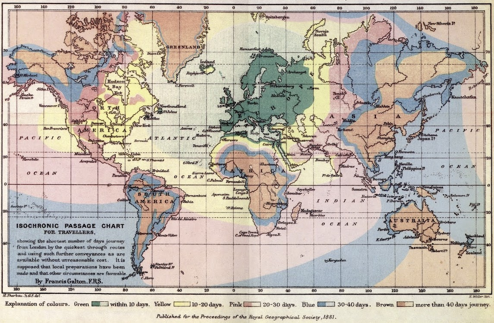

Here's an interesting historical map that turned up on [/r/MapPorn](http://www.reddit.com/r/MapPorn/comments/27yfn0/isochronic_passage_chart_for_travelers_global_map/ "Link to Reddit thread") today. Made by Francis Galton for the Proceedings of the Royal Geographic Society in 1881, I find it particularly interesting because it represents the state of international travel only a decade or so after my Scottish and Irish ancestors travelled to New Zealand.

I know the most about the travelling arrangements of my Scottish ancestors. They travelled with a stop over in Cape Town, South Africa. The [Blundell](http://www.ngaiopress.com/blundlst.htm) is the ship my ancestors who share my surname were on, and it arrived in Dunedin apparently 40+ days since it left Scotland. Robert Law, who was three years old (!) when he made the journey, eventually married Jean Harrison, who was also on the Blundell (as a one-year-old!). It is precisely that historical fact that provides a direct link to this content you are reading right now. Never complain about a baby crying on a forty-minute flight.

The work of cartographers past is often so impressive on their own merits (although I suspect the chaff has been cut with time) yet when you also consider the technology that they *didn't* have to make their maps... the mind boggles and you realise that all of use currently practising the skill have it so easy. Really, if work of this calibre could be made then, there are no excuses for bad maps now.

One particular technique I'd like to draw attention to is the shape of the coastlines. They're *really wobbly*. I suspect this is probably because nice little shapefiles didn't exist for downloading—but the effect that this has is to express that coastlines are complex features even if that complexity isn't well known. Rather than generalise coastlines to rather round shapes (which would be fine at this scale, really), they have been deliberately densified.

Finally:

> It is supposed that local preparations have been made and that other circumstances are favourable.

I love this. These kind of assumptions have been made for over a hundred years in transportation analysis and cartography. Always read the fine print.
