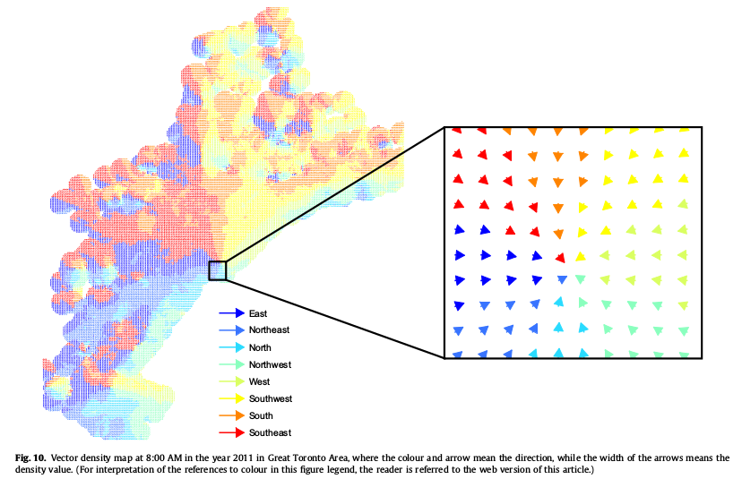
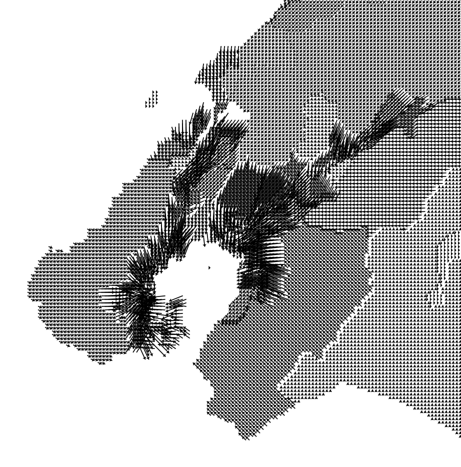

I just finished reading an interesting paper by Xintao Liu and colleagues entitled *Time-geographic relationships between vector fields of activity patterns and transport systems*, in the [Journal of Transport Geography](http://www.sciencedirect.com/science/article/pii/S0966692314002191).

I don't really have much to say about it, but I'll post a link to it anyway so I don't forget about it: I've briefly explored this technique in the past, and hope to revisit it in the future. It's pretty damn hard.

Do you know of any similar examples?
