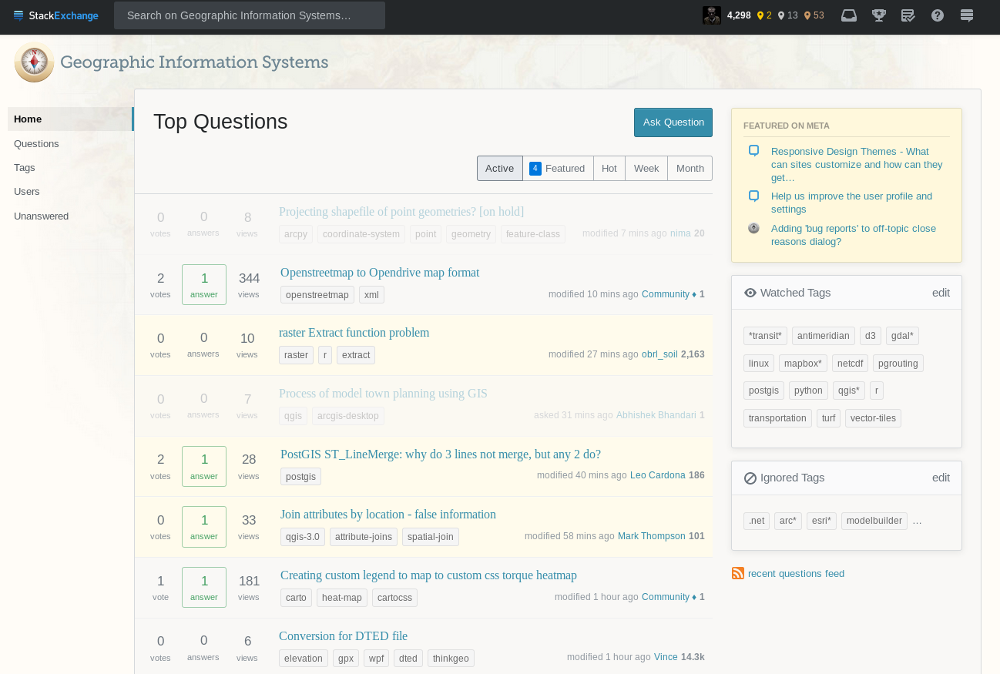

A quick tip to improve your experience with [GIS StackExchange](https://gis.stackexchange.com/), or any StackExchange site for that matter.

[**"Watched Tags" and "Ignored Tags" accept wildcards**](https://meta.stackexchange.com/questions/32919/ignore-tags-using-wild-card). I like GIS.SE, but unless you tweak it, there's a lot of noise and not enough signal. One way to improve that is to add things you're interested in to your *Watched Tags*, and conversely those things you are disinterested in to your *Ignored Tags*.

I personally don't use ArcGIS, or related Esri- or Microsoft-ecosystem tools. So for me, I can't offer any advice on how to do anything with them. Yet there's a lot of people in the spatial community who do use Esri products. I had set up my filters with a very long list of exclusion rules using specific tags, e.g. `arcgis-10.4`, `arcgis-10.5`, `esri`, `esri-company`, `arcgis-online`, `arcpy`, etc. This filtered out a lot of questions I was not interested in reading, however it's very verbose since there are a lot of `arc*` questions. It is also unwieldy because everytime there's a new ArcGIS major or minor version release, there are a series of new tags created.

To get around this, you can simply use wildcards in your tags. Now my Ignored Tags are simply `.net`, `arc*`, `esri*`, `modelbuilder`, `oracle`, `sql-server*`. I gave my Watched Tags a similar treatment (e.g. `qgis*`). Now I have a nice looking set of questions and should not need to revisit my tags as often.

