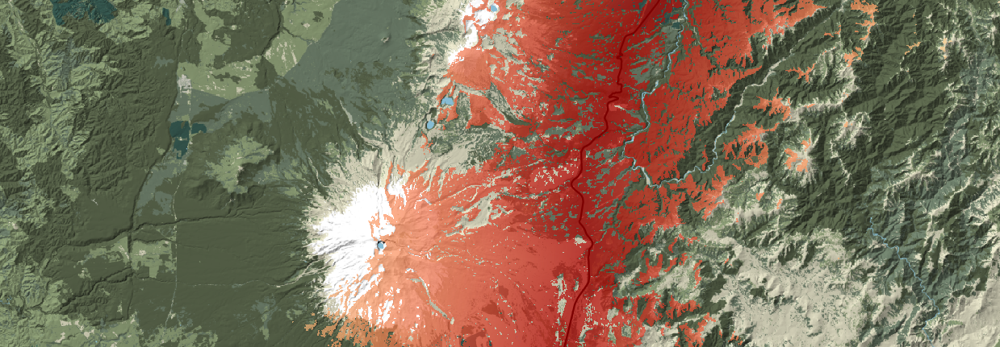
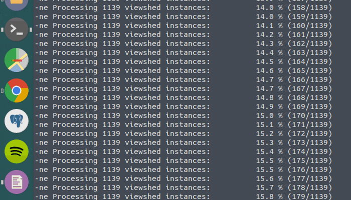
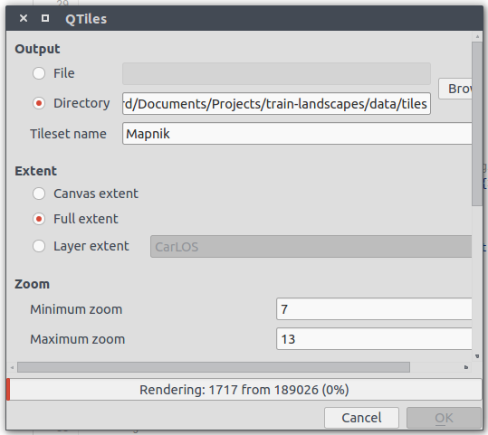
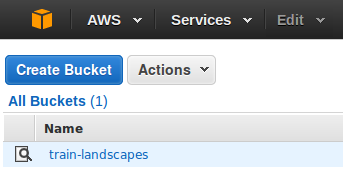
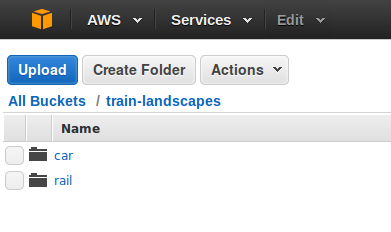
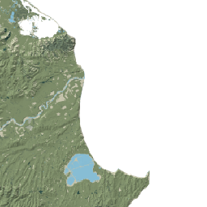
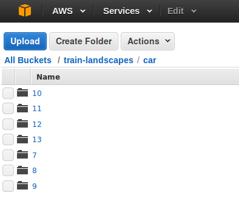

Some moons ago, I met Dr Pierre Roudier, who works at [Landcare Research New Zealand](http://www.landcareresearch.co.nz/home), at a workshop on PostGIS being held at the National Institute for Water and Atmospheric Research ([NIWA](https://www.niwa.co.nz/)). I was just getting started on PostGIS at the time, having identified that I was probably going to need it for my masters thesis. The two-day session, led by Digital Mapping Solutions New Zealand ([DMS](http://www.mapsolutions.co.nz/)), was brilliant. It gave me just enough of an introduction to PostGIS to realise its capability, and a leg-up to explore the rest on my own. I ended up relying entirely on PostGIS for my masters thesis, and now I swear by PostGIS and PL/pgsql as the solution to most issues calling for a spatial database.

What has this got to do with anything? A few things:

1. For the love of all things holy, attend events like these if you can. You meet interesting people, get pizza (I ate kangaroo), and get a kick up the bum to learn new things that, honestly, you wouldn't have bothered learning on your own. (In my case, the only reason I was able to attend was that I'd won a small cash prize for talking about my thesis—so you if you're studying, try jump on small opportunities like that, too.)

2. Pierre ran a tutorial at the end of the first day on GRASS GIS. It really piqued my interest in GRASS. At the time, I was struggling with a batch viewshed calculation for work using ArcGIS. It was falling over due to the size of the computation. I described the problem to Pierre, and he said that it sounded like something GRASS could do no problem. Problem was, I'd never used GRASS. It looked hard and scary: it barely has a GUI. Pierre gave me a headstart on the computation, and I adapted his example to my need. It wasn't actually that bad, once I'd seen a complete, straightforward example.

3. I realised the value of a gentle introduction to a new technique, that actually fulfils some goal you have in mind.

This last point is now really important to me. If I'm trying to learn something new, it has never truly helped me to open a book or the documentation and work through silly, disconnected examples one by one. I actually have to make something useful for myself. **Solve your own, tangible problem.**

Doing this gives you enough motivation to finish, to finish well, and to know when you have finished. It also means you run into a wide variety of problems that your textbooks examples never mention; like, how do you write an iterator in bash?

## What are you going to learn?

This is a tutorial on using GRASS, Git, Leaflet, bash, JavaScript, CSS, HTML, and hosting map tiles on Amazon AWS. Yes, all of those. No, not to exhaustion. Rather, I've written the tutorial that I would like to have found a few months ago. A tutorial that takes a tangible (albeit frivolous) problem to completion, and uses a realistic combination of tools to solve it. You'll see how these separate tools come together, and how you could then take pieces here and there and work on something completely different. That's an effective way to learn, if you invest into the idea of the project, and are willing to use this tutorial as a springboard for your own idea.

The end result is this [interactive map](/train-landscapes).

<p class="sidenote">The map tiles are now broken, as I was not willing to pay to host the tiles for long.</p>

## What I can't cover

I will not cover [beginning with Git](http://readwrite.com/2013/09/30/understanding-github-a-journey-for-beginners-part-1), or fundamental Git concepts. But you'll learn some commands and how to host an interactive map on the Internet for free with Github pages.

I will not cover getting started with GRASS. Although this won't be a terrible introduction, I'm not detailing introductory concepts or using the GUI.

<div class="sidenote">
  <p>
    Try
    <a href="http://grass.osgeo.org/documentation/first-time-users/">[1]</a>,
    <a href="http://grass.osgeo.org/grass70/manuals/helptext.html">[2]</a> or
    <a href="http://grasswiki.osgeo.org/wiki/Quick_wxGUI_tutorial">[3]</a> instead,
    and then come back.
  </p>
</div>

I had the benefit of a hands-on GRASS introduction at the DMS/NIWA workshop.

I won't be discussion web hosting of maps in much depth. I'm not yet much of a web developer, and I've only tinkered with Amazon AWS to get this to work. I'm not an authority.

## What do you need?

If you want to code along, you'll need to install GRASS GIS (6.4 or 7.0). Git is optional; if you're not familiar with it, I'd like to just show you how can use it in a little project like this.

I use Ubuntu for my desktop operating system. I don't know how easy GRASS is to install on Windows or Mac, but I like to use the [ubuntugis-unstable PPA](https://launchpad.net/~ubuntugis/+archive/ubuntu/ubuntugis-unstable). This has GRASS 6.4 bundled up. GRASS 7.0 is faster due to the addition of new functions, so use that if you're comfortable. If you're not using a flavour of Linux, look into getting a virtual machine set up---it's surprisingly easy and you'll not regret it.

I'm also going to have to assume a modicum of familiarity with GIS, and some programming concepts (variables, iteration, functions, etc.). Yet you also need a willingness to learn! I'm still learning more about programming every day, even though I now get paid to do it, so if there's anything that I seem to have brushed over, don't feel too shy to ask me to explain it further.

# The problem

I talked to Pierre about a train trip across the North Island of New Zealand, known as the *Overlander*. He often takes the train to get to Wellington, and I've taken the Overlander several times to get between Auckland and Wellington. It is a lot slower than flying (by around 11+ hours), but personally I find it more enjoyable. In addition to your ability to get some solid solo productive time, it is very scenic. Being Spatial Scientists™, Pierre and I discussed how one could go about quantifying the *scenic-ness*... *scenicity*... the *je ne sais quoi* of the trip.

To solve this problem, you need to think abstractly about it, and then apply that back to the real problem, phrased in reduced, but practical terms:

**Given a line feature, how can you determine the places that are visible are from the line?**

Translated into the vernacular: if you're sitting on the train, what can you see out of the window?

What could be taken into consideration in this case, from a spatial perspective? The most straightforward ideas include: what is the terrain like? (Hills block views of what is behind them.) How far can you see out the window? ([Distance to the horizon](http://en.wikipedia.org/wiki/Horizon#Distance_to_the_horizon), coupled with personal eyesight, and atmospheric refraction.)

The not-so-straightforward, or even unresolvable issues include: are you on the left or right side of the train? Is the train going north or south? What speed is the train travelling at? Can you actually see out of the window? Is it dark? Are you asleep? Are there trees in the way? Are there tunnels?

Like all good spatial problems, the difficult issues outnumber the tractable ones. **We're just going to be thinking about visibility as determined by the bare terrain, using a constant distance to the horizon.** This (arguably) gives us some measurement of the *maximum extent* of space that is visible, which could be refined further.

The two most influential decisions are the resolution of our terrain model, which determines blocking, and the distance to the horizon, which in an ideal world considers the curvature of the earth and an observer's elevation.

### Setting up with Git

Launch your terminal, and navigate to somewhere where we can place a folder of interesting stuff (our project code and input data).

`git clone` my GitHub repository with the following command:

```bash
git clone https://github.com/alpha-beta-soup/train-landscapes
```

This creates a folder called `train-landscapes` in your current directory, within which the project is "cloned": duplicated for your local consumption.

If you browse my Github repository in your web browser via the link in the `git clone` command, you'll see that I originally "forked" this project from Pierre. That is, he started it, and I carried it on with my own changes. Pierre wrote the initial version of the GRASS procedure, targeting GRASS version 7. I adjusted this script, to make it work a bit faster with a larger input and higher resolution raster terrain model. I also made a second version that would work with GRASS 6.4, which is what I was using at the time. That's what's great about Github and open source code generally: being able to take someone else's idea, and use it or run with it.

After cloning, you'll see that there are a few files and folders, if you enter the `train-landscapes` directory. `.gitignore` is a text file with the following contents:

```
data/
```

This tells Git to not track files (or changes to files) in the directory `data/` (which contains the source and output data, like the terrain DEM/hillshade model that I used as input).

The hillshade and digital elevation model (DEM) I used for this project are several gigabytes in size; I haven't included them in the project to save you the bandwidth. Likewise, the tiles that actually constitute what you see on the map aren't on Github either (they're hosted by Amazon, more on that later). The `.gitignore` file is a handy way to manage issues like this one on excluding large datasets from source control when they don't need it. For following along with this tutorial, you can download any DEM of New Zealand (projected to NZTM NZGD2000) that you have the rights to use. (You can of course pick a region anywhere else in the world.)

We also have `README.md`, which is the Markdown file that provides the documentation you can see on the front page of the GitHub repository for this project.

`index.html` is where we have a simple webpage displaying a Leaflet map. We'll get to this later.

The directory `data` contains the input vector features I used for this project: the train and road features that we determine visibility from. However, you can't actually download this directory, as I've added it to the `.gitignore`.

The directory `source` contains the real work: our project code. We can list its contents from the terminal with the `ls` command:

```bash
ls source/*

  generate_los.sh
  generate_los_70.sh
  make_map.js
  obtain_corners.py
  style.css
```

The `generate_los` shell scripts (`.sh`) are files that contain a series of commands that will be understood by GRASS GIS, versions 6.4 and 7. Let's consider them now.

### GRASS and shell scripts

If you have installed GRASS, you can start it up at the command line by running the appropriate command for your version of GRASS: `grass64` or `grass70`.

After a short moment, a two-window GUI will open up. GRASS uses some concepts and terminology that are pretty hard to get your head around becausr they are different to other GIS programs, particularly the idea of a "mapset". You should be able to use the default, "PERMANENT" mapset for this tutorial, but I encourage you to look for some other GRASS tutorials that consider making your own mapsets. For now, you can just close or ignore the GUI windows as we will not be using them.

Let's consider the GRASS 6.4 code (a shell script written in bash). Open `generate_los.sh` in a text editor. To do this with Gedit from the command line:

```bash
gedit source/generate_los.sh
```

Browse through the file for a bit.

The very first line is a "shebang" that just tells the program loader what kind of interpreter to use. Here, we are using bash, as opposed to an alternative UNIX shell, like dash.

```bash
#!/bin/bash
```

After that, we define a function called `usage`. Usage is called upon when checking inputs to the terminal when the code is executed. The function `usage` prints out a small bit of documentation for our code, telling a user that one of two possible arguments can be used: `-train` or `-road`. Choosing train will make sure the script uses some parameters that apply to travelling by train, and similarly for travelling by road.

<p class="sidenote">Disclaimer: I don't actually know if this is proper practice for writing what is essentially help documentation. I can't imagine it's too far from this.</p>

The `usage` function and argument parsing:

```
usage() {
   cat << EOF
Usage: generate_los.sh [-train | -road]

-train    perform the viewshed analysis for the train journey
-road     perform the viewshed analysis for the road journey
EOF
   exit 1
}

if [ $# -ne 1 ]; then
   # Number of arguments
   # If there is more or less than one, do usage()
   usage;
fi

if [ "$1" != "-train" ] && [ "$1" != "-road" ]; then
  usage;
fi
```

`if [ $# -ne 1 ]; then` considers all of the arguments that a user enters alongside the command to execute the GRASS shell script. If the number of arguments is not equal to one (`-ne 1`), then the condition is reached: run the `usage` function.

`usage` tells our naïve user that they have to run either (and only one of) these commands at the terminal to get things going:

```bash
sh execute_los.sh -train
sh execute_los.sh -road
```

Failure to do so simply prints an instruction to the terminal, and causes the script to stop with exit code 1 (`exit 1`), a catch-all for general errors.

If the number of provided arguments is equal to one, we then check if this argument is in the realms of expectation (argument `"$1"` is `-train` or `-road`). If the first argument is not equal to `train` (`"$1" != "-train"`) or `-road`, then `usage` is triggered again. Otherwise we go on our merry way: setting up some variables according to `train` or `road`:

```bash
if [ $1 = "-road" ]
then
    LINE_SHP='../data/road/roads.shp' # Roads shapefile
    PTS_FILE="../data/road/road_points_coords.csv"
    # ^ An intermediate output of this script; coordinates of LINE_SHP
    ELEV=1.2 # Metres above the ground that the observer stands
    # ^ just a guess (note, try include the vehicle, too)
    OUTFILE="dist_los_car" # Name of final output raster
elif [ $1 = "-train" ]
then
    # We live in a post-shapefile world, baby!
    LINE_SHP='../data/train/nz-railway-centrelines-topo-150k.gpkg' # Rail geopackage
    PTS_FILE="../data/train/rail_points_coords.csv"
    # ^ An intermediate output of this script; coordinates of LINE_SHP
    ELEV=2.5 # Metres above the ground that the observer stands
    # ^ just a guess (note, try include the vehicle, too)
    OUTFILE="dist_los_rail" # Name of final output raster
else
    usage; # shouldn't need this
fi
```

We define a number of variables that have global scope for the remainder of the script:

<div class="newthought">
  <h5><code>LINE_SHP</code></h5>
  <p>A line "shape", or vector feature. GRASS is happy accepting a wide variety of vector formats, and we don't even have to specify what they are. In my case, I downloaded both an Esri Shapefile (for the road following State Highway 1 between Auckland and Wellington) and a <a href="https://github.com/opengeospatial/geopackage">GeoPackage</a> (for the main trunk railroad of the North Island).</p>
  <p>Before running this script, I used QGIS to remove all features from my original dataset that I wasn't interested in. I could have also performed this filtering in GRASS, which would have had the advantage of making it easier to change my region of interest another time.<p>
</div>

<div class="newthought">
  <h5><code>PTS_FILE</code></h5>
  <p>The "points file": a dataset that will be created in the course of the script's execution, and represents points spaced along our original line features. These points represent all of the viewing opportunities we are going to calculate viewsheds for.<p>
</div>

<div class="newthought">
  <h5><code>ELEV</code></h5>
  <p>GRASS' viewshed tools allow us to set observer heights. That is, if you're trying to determine what you can see from your house, ideally you'd account for the fact that your eyes are not at ground level. Importantly, <strong>a train is higher up than a car</strong>, and defining the value of this variable <i>conditionally</i> allows us to be slightly more germane when coming up with the answer to our problem.</p>
</div>

<div class="newthought">
  <h5><code>OUTFILE</code></h5>
  <p>The name of the final output raster that we'll collect up at the end and open to see the result. As we will see, the final output is actually just a GeoTiff (image with a spatial projection). We need to have a different name depending on whether we are calculating train or road visibility, as we wouldn't want one to overwrite the other.</p>
</div>

Following the conditional variables, there are some variables that are considered constant regardless of our mode of transport:

```bash
R_DEM='../data/hillshade/nidemreproj' # Elevation DEM
R_RES=25 # The resolution of the DEM (metres)
DIST_PTS=25 # Ideally the resolution of the DEM
MAX_VIS_DIST=30000 # Maximum distance visible
```

<div class="newthought">
  <h5><code>DIST_PTS</code></h5>
  <p><code>DIST_PTS</code> is a really important parameter. It will be used to determine how far our source viewing locations may be from one another. There is no point in this value being smaller than <code>R_RES</code>, because two different points that lie within the same cell of our terrain model will have the same viewable cells.</p>
</div>

<div class="newthought">
  <h5><code>MAX_VIS_DIST</code></h5>
  <p><code>MAX_VIS_DIST</code> is also very important. It defines the maximum distance from one of our viewing spots that can be considered visible to an observer. It is stated in the same units as the projection system uses; which in my case is metres.</p>
</div>

Together, these global variables determine the precision of our output, and therefore how much of a computational challenge this can be. Taking this to the extreme, you could look at a sub-metre terrain model, and consider a near-continuous movement of a passenger who can see for miles and miles... but you'd need a supercomputer or a very long time to get your output. And when your output is ready, it would still be subject to many of our original limitations (lack of trees is probably the biggest one). Your output would actually be subject to [**false precision**](http://en.wikipedia.org/wiki/False_precision): a very important concept in GIScience.

While testing, I used a `MAX_VIS_DIST` of only 100 metres, and a `DIST_POINTS` of thousands of kilometres. This did not give me the actual output I was after, but tested the logic of the code and calculated very quickly even on the real datasets. The parameter values above are the ones that I used when making the real output, which took several days to calculate. This is still a very expensive calculation!

### Preparation for GRASS 6.4

Next up, we are preparing to actually use the command `r.los` ("raster"."line of sight"). Here GRASS 7.0 has a strong advantage over GRASS 6.4. [The documentation for `r.los`](http://grass.osgeo.org/grass64/manuals/r.los.html) states the following:

> The time to complete the calculation increases dramatically with the region size. Try to keep the columns and rows under 1000.

The equivalent GRASS 7.0 command, not available in GRASS 6.4 is `r.viewshed`, and it does not suffer so.

In order to keep the number of rows and columns in our calculation under 1000, we actually need to adjust the variable `MAX_VIS_DIST` while considering `R_RES`, as the two are actually tightly linked. The following commands create a new intermediate variable, `POS_VIS_DIST` (possible visibility distance), which determines the maximum distance we can possibly define as "visible" without exceeding the limit of 1000 rows or 1000 columns in our visibility calculation. If `POS_VIS_DIST` ends up exceeding `MAX_VIS_DIST`, then we opt for `POS_VIS_DIST` by setting `MAX_VIS_DIST` equal to `POS_VIS_DIST`; otherwise we keep on with our original value of `MAX_VIS_DIST`.

```bash
# r.los takes a long time, and the manual says to keep
# the number of rows and columns "under 1000". Here we
# adjust MAX_VIS_DIST by considering the resolution of
# the raster (R_RES), so that there is a maximum of
# 1000 rows and columns

# The maximum possible vis dist to use and still have
# 1000 rows and cols
POS_VIS_DIST=$(echo "$R_RES * 1000 / 2" | bc -l)

if [ 1 -eq `echo "$POS_VIS_DIST < $MAX_VIS_DIST" | bc` ]
then
  # If the maximum distance r.los can sustain exceeds the
  # user-selected value, override it
  echo "The MAX_VIS_DIST parameter has been changed \n
  from $MAX_VIS_DIST to $POS_VIS_DIST for performance \n
  reasons."
  MAX_VIS_DIST=$POS_VIS_DIST
fi
```

To understand this, we should consider what each line is actually doing.

`POS_VIS_DIST=$(echo "$R_RES * 1000 / 2" | bc -l)` instantiates a variable that is equal to the resolution of the raster, multiplied by 500. This represents how many cells in any direction an observer can "look" without the number of rows or columns exceeding 1000. `bc` is a command to access "an arbitrary precision calculator language" (it calculates numbers). The pipe (`|`) is a way to connect the output of the left command to the input of the right command.

In the shell you could write:

```bash
POS_VIS_DIST=$(echo "25 * 1000 /2" | bc -l)
echo $POS_VIS_DIST
```

And it would spit out the value of your calculation: 12500

The next piece of logic is to compare this number to our `MAX_VIS_DIST` to see if it is larger:

```
if [ 1 -eq `echo "$POS_VIS_DIST < $MAX_VIS_DIST" | bc` ]
```

Consider the following commands:

```
v1=$(echo "10 < 20" | bc -l)
v2=$(echo "20 < 10" | bc -l)
```

Can you see that we're doing inequality checks? The value of `v1` is 1, true (10 is less than 20); the value of `v2` is 0, false (20 is not less than 10). `if [ 1 -eq result ]` then asks "if 1 is equal to result", or more fluidly, "if result is true". If it is, then you can see above that we reset `MAX_VIS_DIST` as it violates our 1000 rows and columns constraint.

### Distance to the horizon

Now at this point it is a good idea to point out that I have actually picked arbitrary values for `MAX_VIS_DIST` in this example. There are more robust methods to determine the distance to the visible horizon that depend on the elevation of your position, and the curvature of the earth. The value can actually vary quite markedly. The GRASS documentation offers a nice approximation, but `r.los` itself does not take into account the curvature of the earth:

> The curvature of the Earth is not taken into account for these calculations. However, for interest's sake, a handy calculation for distance to the true horizon is approximated by d = \sqrt{(13 \times h)}where *h* is the height of the observer in meters (above sea level) and *d* is the distance to the horizon in km. This may be useful for setting the max_dist value.

You could implement this in GRASS with a bit of `bc` and considering the elevation value of each cell beneath each observer point, but I'll leave that as an exercise for the reader (God I hate that). Consider this a reminder that any proposed solution to a geographic problem can almost always be improved.

A partial solution is to switch to GRASS 7.0: [`r.viewshed`](http://grass.osgeo.org/grass70/manuals/r.viewshed.html) allows a `-c` flag that considers the curvature of the earth better than you could—with reference to the current ellipsoid:

> By default the elevations are not adjusted for the curvature of the earth. The user can turn this on with flag -c.

However this **still** doesn't resolve the problem of determining the actual distance to the horizon. In part, this is because that also depends on atmospheric conditions. For example, on an exceptionally clear day, when the atmospheric pressure is just right, you can actually make out Mt. Taranaki when standing on the Kāpiti Coast!

### Further preparation for the line of sight calculation

```bash
# Load shapefile into GRASS
v.in.ogr dsn=$LINE_SHP output=line_feature --o --v

# Load elevation raster into GRASS and set it as the computational region
r.in.gdal --o input=$R_DEM output=dem --verbose

# Sample points along line
v.to.points -ivt in=line_feature out=line_feature_points dmax=$DIST_PTS --o --q

# Put point coordinates in text file
v.out.ascii -r in=line_feature_points fs=, --quiet | awk -F "\"*,\"*" '{print $1","$2}' > $PTS_FILE

NPTS=`cat $PTS_FILE | wc -l`
```

Try and see if you can work out what this section of code does. If you have GRASS running in your terminal, you can find out what any given GRASS command does with the following pattern: `r.command --help`, which is the same pattern for most commands at a UNIX terminal. You can also consult the online help.

To summarise the help documents for the GRASS commands used here:

1. `v.in.ogr`: Convert OGR vector layers to GRASS vector map.

2. `r.in.gdal`: Import GDAL supported raster file into a binary raster map layer.

3. `v.to.points`: Create points along input lines in new vector with 2 layers.

4. `v.out.ascii`: Converts a GRASS binary vector map to a GRASS ASCII vector map.

In conjunction with the `--help` option and my comments, try and work out what exactly these comments are doing. They represent a stage of data preparation for the next processing step. Remember that the syntax `$VARIABLE` is a way to access the value of the variable called `VARIABLE`, we defined several of these near the beginning of the script. If you have any questions, leave a comment.

## Computing viewsheds iteratively

The general logic of the viewshed calculation is to take a series of points sampled along a line feature, find all places on the terrain model that a person standing on each point can see, and then mosaic each of these together into a final visibility surface. There are ways to make this smarter, such as using the fact that once a cell has been identified as visible from any point, to never bother querying whether it is visible again. I don't explore these, although I might if I ever need to re-use this code.

```bash
echo -n "\nComputing viewsheds\n"

COUNTER=0
while read -r line
  do

  PCT_FLOAT=$(echo "100*$((COUNTER+1))/$NPTS" | bc -l)
  PCT=`printf "%0.1f\n" $PCT_FLOAT`

  echo -ne "Processing $NPTS viewshed instances: \t $PCT % ($COUNTER/$NPTS) \r"

  # Set the region to a smaller subset around the current observer point
  #   to speed processing
  x=$(echo $line | cut -f1 -d,)
  y=$(echo $line | cut -f2 -d,)
  W=$(echo "$x-$MAX_VIS_DIST" | bc -l)
  E=$(echo "$x+$MAX_VIS_DIST" | bc -l)
  N=$(echo "$y+$MAX_VIS_DIST" | bc -l)
  S=$(echo "$y-$MAX_VIS_DIST" | bc -l)
  g.region n=$N s=$S e=$E w=$W

  # Does not overwrite, so SIGINT (Ctrl+C) can be used to interrupt a
  #  long-running process, to be resumed later
  #  (keep parameters constant between runs)
  r.los input=dem output=tmp_los_${COUNTER} coordinate=$line obs_elev=$ELEV max_dist=$MAX_VIS_DIST --v
  COUNTER=$((COUNTER+1))

done < $PTS_FILE
```

We begin by creating a variable, `COUNTER`, to store our progress through an iteration. Then we start looping. That's actually a bit hard to comprehend, so I'll explain it closely:

```bash
while read -r line
  do
  # do something
done < $PTS_FILE
```

Notice that before this point, `line` didn't exist. `line` is actually being defined on the last line of the loop syntax: `done < $PTS_FILE` pipes the text file `$PTS_FILE`, representing a sequence of points along a line, into the for loop; each line of the file is then put into a variable called `$line` that we access during the execution of each loop.

The first thing that gets done in the body of the loop is to return some information to the terminal, reporting on the progress of the loop. See if you now understand enough about `bc` to see how `PCT_FLOAT` is the progress of the loop expressed as a percentage value of floating point precision. `PCT` stores the result rounded to one decimal place.

### GRASS regions

Next up, we use a bit of black magic to speed up the processing. GRASS uses the concept of "regions" when running calculations. Every command will consider the current region, and nothing will be done outside of that region. So if you're calculating a viewshed (a very expensive procedure), and you know the maximum distance that you consider viewable from any point, you can tell GRASS that its region can be as small as that area. Annotated code:

```bash
# Set the region to a smaller subset around the current observer point to speed processing
# Note that this assumes the source line feature is projected in metres
x=$(echo $line | cut -f1 -d,) # Get the x coordinate value from line, the current observer point
y=$(echo $line | cut -f2 -d,) # The corresponding y value
```

Try `cut --help` coupled with the clue that `$line` is comma-delimited, if you don't understand this.

```bash
W=$(echo "$x-$MAX_VIS_DIST" | bc -l) # x minus the maximum visible distance: the western reach of the region
E=$(echo "$x+$MAX_VIS_DIST" | bc -l) # x + MAX_VIS_DIST: eastern reach
N=$(echo "$y+$MAX_VIS_DIST" | bc -l) # y + MAX_VIS_DIST: northern reach
S=$(echo "$y-$MAX_VIS_DIST" | bc -l) # y - MAX_VIS_DIST: southern reach
```

Finally, we use this command to actually set the region in each iteration: `g.region n=$N s=$S e=$E w=$W`. I found that resetting the region each loop was remarkably faster than leaving the region equal to the union of all inputs.




The final section of the loop performs the following:

```bash
r.los input=dem output=tmp_los_${COUNTER} coordinate=$line obs_elev=$ELEV max_dist=$MAX_VIS_DIST --v
COUNTER=$((COUNTER+1))
```

`r.los` is the command that we're really here for. It takes an input DEM, outputs a raster named `tmp_los_` plus whatever the counter is up to, a point value (our `$line` variable), and the observer elevation... and it goes away and tells us what that observer can see. Well, not really *what* they can see, more *where* they can see. The "what" can come later with some more Spatial Science™. For now, we close the loop and give it its input to set it in motion: `done < $PTS_FILE`.

### One Viewshed To Rule Them All

```bash
# Set computational region to full extent
g.region -pm rast=dem --verbose

# Combine results in a single map
#   (aggregation method doesn't matter as we use
#   this as a boolean mask)
echo "\nCombining component viewsheds\n"
# Loops because otherwise can easily exceed default hard limit of number of
#   rasters that can be open at once (1024)
for i in `seq 0 99`;
do
  # Combine a subset of all the viewsheds
  # * is a wildcard for zero or more characters
  if [ $i -le 9 ] # If i <= 9
  then # append a 0 to the start of $i
    PATT=tmp_los_*0$i
    OUT=total_los_0$i
  else # don't modify the pattern of $i
    PATT=tmp_los_*$i
    OUT=total_los_$i
  fi
  r.series in=`g.mlist --q type=rast pattern=$PATT sep=,` out=$OUT method=sum --o --q
done
```

Now that we have created each of the viewsheds for each of the points we sampled along the road or train line, we want to combine these individual raster layers into a single raster layer.

There is considerable scope for interesting complexity here. For instance, you could combine the results additively, thereby building a surface where each cell has a value from 0 (never seen) to a potentially very large number (seen from many of the points along the route). If you assume that the train travels at a constant speed, this surface would tell you how long you spend looking at any given 25x25 metre grid cell. You could then use this to determine what type of forest you spend more time looking at: native or exotic.

I'm going for an easy option: not worrying about how the layers are combined. I want a simple Boolean surface: can a cell be seen at any point in the trip, or can it never be seen? There's no room for ambiguity, and the result is not as useful as the rest of the code allows it to be. But, I don't have a "real" application for this to matter. If you want to fork the repository again on Github and explore this for yourself, go right ahead!

First, we use `g.region` to reset the region to the full extent of our input raster layer. Recall that without this command, the region would be stuck at whatever it was in the last iteration of the preceding loop!

Then (after some comments and printing information to stdout) we enter a loop that seems a little unnecessary. If we're combining a bunch of raster layers together all at once, why do we need a loop? The answer is because GRASS 6.4 does not like it if you try and open more than 1024 rasters at any one time. As we would have made thousands of new rasters by this point, we cannot actually combine them all at once; rather we have to do it gingerly, in stages.

Therefore the pseudo-code is to:

1. Start a loop from 0 to 99

2. Get the value of the iterator in the style of 00, 01, 02, ..., 98, 99 (i.e. a leading zero for numbers less than 10).

3. Create a pattern variable (`PATT`) to store the pattern that our input point-specific viewshed rasters follow if their filename ends with 01, or 02, or whatever the iterator is at. (This will allow us to process roughly 1% of the input rasters in each step.)

4. Perform the actual combination for a subset of the layers matching `PATT`.

`r.series` is the key command of the above codeblock. It takes as its `in` parameter a list of layers that is constructed by a second command, `g.mlist`.

`.g.mlist` is a **very** handy GRASS command. Take a look at its description in its help:

> Lists available GRASS data base files of the user-specified data type optionally using the search pattern.

So when we want to combine only a fraction of our intermediate viewshed rasters at one time, we tell `g.mlist` to go away and find all layers that match a particular pattern (e.g. all rasters called `"name_\*00"`, where `*` is a wildcard—that is, all of our intermediate layers ending in "00"). `r.series` then takes this list of layers and combines them with the `method` we have specified. (I used `sum`, although as I said I actually ignore this.)

What we're then left with is a series of 99 raster layers, each representing a small part of what will become our finished product.

<div class="sidenote">
  <p>
  I realise now that it would be smarter to combine the intermediate layer with the pattern-match layers as part of the above loop... but at the price of one additional <code>r.series</code> it ain't the end of the world.
  <p>
</div>

So, combine these up into our finished product with another pattern matching exercise:

```bash
r.series in=`g.mlist --q type=rast pattern=total_los_* sep=,` out=total_los method=sum --o --q
```

You could display the result now if you wanted the map to represent the number of times each cell has been determined as being "viewable". I actually like the idea of a binary (viewable/not viewable) surface, where shading can be used to indicate distance from the line feature. So that's what I'll do. However it may be a little misleading, as distance from the line feature used in the exercise is not technically synonymous with the minimum distance from which it can be seen!

```bash
# Create distance to line_feature map
echo "\nDetermining distance from features\n"
v.to.rast in=line_feature out=line_feature use=val val=1 --o --q
r.grow.distance -m input=line_feature distance=dist_from_line_feature --o --q
```

This takes our line feature input and turns it into a raster; it then "grows" (raster buffers) this line... how far? To the same size as the entire GRASS region. There is no need to tell GRASS that; and it stores the output surface as a dataset specified by the rather misleading title of `distance`.

```bash
# Use distance to line_feature instead of sum of times seen in the result map
echo "\nSubstituting number of times seen for distance to cell from line\n"
r.mapcalc "$OUTFILE = if(total_los, dist_from_line_feature, null())" --o --v
```
Here we use a bit of raster calculation (otherwise known as image manipulation) to make a new layer. To put the if statement into human terms: "if there is a  non-null value of `total_los` (i.e. a cell has been identified as visible), substitute its value with the value of the equivalent cell from the layer `dist_from_line_feature` (a raster surface where each cell knows its minimum distance from the line feature), otherwise make its value null.

The rest should be self-explanatory:

```bash
# Write output (as geotiff)
r.out.gdal input=$OUTFILE output=../data/output/$OUTFILE.tif format=GTiff --o --v

# Clean up, removing the component visibility rasters, only after outputs have been written
echo "\nDeleting temporary files\n"
g.mremove -f "tmp_los_*" --q
g.mremove -f "total_los_*" --q

echo "\ngenerate_los.sh complete\n"
```

The final output is simply a GeoTiff. Try opening it in QGIS if you have been playing along at home. If you're just reading, then in the [interactive map](http://www.nearimprov.com/train-landscapes), the output GeoTiff is the special coloured layer you see on top of the basemap.

So how do we get to this next stage?

# Making Mapnik tiles with QTiles

There are a variety of ways to make map tiles. The simplest method for constructing map tiles, in my opinion, is to use a QGIS plugin called [QTiles](https://github.com/nextgis/QTiles). You can control all your styling and extents with QGIS layers, and then just tell the plugin to go away and make your map tiles.

To find out how to install a QGIS plugin, look [here](http://www.qgistutorials.com/en/docs/using_plugins.html).

The process for our purposes is rather simple.

1. The GRASS script spits out a GeoTiff.

2. You add that to a QGIS project via the add raster layer button.

3. The GRASS script also had access to a vector line feature (as well as creating a CSV point dataset from that). You can add one or both of these via the add vector layer button.

4. To add context, add a pre-existing baselayer, or make your own. For example, you could create a colour relief map (hypsometric tint). [Mapbox has a good tutorial using more command line GIS](https://www.mapbox.com/tilemill/docs/guides/terrain-data/), this time GDAL. I just took the easy route (again), and went for a Web Mapping Service ([WMS](https://data.linz.govt.nz/p/web-services/)) from the good folk at Landcare Research. Look for the add data button in the sidebar with the tooltip "Add WMS/WMST Layer". When it opens, create a new connection using the URL to the Landcare Research WMS: `http://maps.scinfo.org.nz/basemaps/wms?`. There are a variety of layers you can add (see image); the one I used is called the "Landcover Terrain Map".

5. Once you've added this basemap, styled and ordered your layers and are happy with the appearance of your map, install QTiles and fire it up via the menu Plugins > QTiles > QTiles. See the second image below for example parameters. Just be cautious before going ahead with your settings: you are generating exponentially more tiles (i.e. PNG images) for each additional level of zoom (1 is the most zoomed out, 18 is the most zoomed in). I only generated tiles between zoom levels 7 and 13, because I knew I was going to restrict the user to these zoom levels in the end. Allow the tool to run, and you're ready to make a web map.




# Making a web-ready map with Leaflet

There are lots of good tutorials on making webmaps, and I encourage you to explore them. I don't consider myself very good at making them (yet). This is a very simple example, using two tile datasets and allowing the user to switch between them.

First, let's look at the HTML: the webpage that will contain our map. (The map itself is made in a JavaScript script.) The HTML is divided into the `head` and the `body`.

The head:

```html
<head>
  <meta charset="utf-8">
  <meta http-equiv="X-UA-Compatible" content="IE=edge">

  <meta name="viewport" content="width=device-width, initial-scale=1.0">

  <link rel="stylesheet" href="http://cdn.leafletjs.com/leaflet-0.7.3/leaflet.css" />
  <link rel="stylesheet" href="./source/style.css" />

  <meta http-equiv="Content-type" content="text/html; charset=utf-8" />
</head>
```

This is all pretty standard, if you've ever hit "View Page Source" on a webpage. Can you see where we tell the page to read the Leaflet CSS (`leaflet.css`)? And a custom bit of CSS (`style.css`)?

Now for the body:

```html
<body>
    <!-- header div -->
    <div id="title-text">
      <h2>
        Travelling overland between Auckland and Wellington: what can you see?
      </h2>
    </div>
    <!-- map div -->
    <div id="map"></div>
    <script src="http://cdn.leafletjs.com/leaflet-0.7.3/leaflet.js"></script>
    <script src="./source/make_map.js" type="text/javascript"></script>
</body>
```

We have two `div` elements in the body, and two scripts. The first `div` contains the header text you see at the top of the map. The second `div`, with the ID of `"map"`, contains our map, although there is very little indication yet that it actually does anything. The clue lies in the two pieces of JavaScript that get loaded next. The first is the standard Leaflet JavaScript that brings along the functionality of every Leaflet slippy map you've ever seen. The second is a custom bit of code where we specify our own special map. This bit of code is in the Github respository, and is called `make_map.js`. Let's take a look at that next.

```javascript
var carViewshed = 'https://s3-ap-southeast-2.amazonaws.com/train-landscapes/car/{z}/{x}/{y}.png',
    trainViewshed = 'https://s3-ap-southeast-2.amazonaws.com/train-landscapes/rail/Mapnik/{z}/{x}/{y}.png',
    southWest = [-41.722,171.748],
    northEast = [-36.441,179.124],
    bounds = [southWest, northEast],
    attribution = 'Richard Law | \
    Pierre Roudier | \
    Basemap © <a href="http://maps.scinfo.org.nz/">Landcare Research</a> 2014. Contains data sourced from LINZ. Crown Copyright Reserved. <a href="http://creativecommons.org/licenses/by/3.0/nz/">CC BY 3.0 NZ</a> | \
    <a href="https://koordinates.com/layer/40-nz-road-centrelines-topo-150k/">LINZ</a> <a href="http://creativecommons.org/licenses/by/3.0/nz/">CC BY 3.0 NZ</a> | \
    <a href="http://grass.osgeo.org/">GRASS GIS</a>',
    global_min_zoom = 7,
    global_max_zoom = 13;

var map = new L.Map('map');
map.setView([-38.6875, 176.0694], 7); //centre and zoom of map, initially
map.setMaxBounds(bounds);
map.options.minZoom = global_min_zoom;
map.options.maxZoom = global_max_zoom;

var car = L.tileLayer(carViewshed, {
  attribution: attribution,
  bounds: bounds,
  minZoom: global_min_zoom,
  maxZoom: global_max_zoom,
  tms: true,
  isBaseLayer: true,
}).addTo(map); //default layer, so add to map

var train = L.tileLayer(trainViewshed, {
  attribution: attribution,
  bounds: bounds,
  minZoom: global_min_zoom,
  maxZoom: global_max_zoom,
  tms: true,
  isBaseLayer: true,
}); //non-default layer, so don't add to map

var viewshedBasemaps = {
    "Car/bus view": car,
    "Overlander view": train
};

// Add the layer control to the map
L.control.layers(viewshedBasemaps).addTo(map);
```

The first unbroken section of code above creates a bunch of variables. While the `var` keyword is only used once, it could be used on each line if the commas at the end were omitted. `carViewshed` and `trainViewshed` are the relative paths to the hosted folders that contain the tiles we made earlier with QTiles. (I'll explain the Amazon business soon.) `southWest` and `northEast` are global parameters that I use to constrain the user's ability to move: I only want them to be able to scroll around the North Island... mostly because that's the only place I've actually created any map. The variables `attribution`, if you're paying attention, is the bit of text you see at the bottom of the map. Leaflet is good about using that, and so should you be.

Notice that `global_max_zoom` and `global_min_zoom` correspond to the numbers I used in the tile generation step. I didn't make tiles beyond the range 7-13, so I don't let the user zoom beyond that range (otherwise they'd see nothing).

I then make a very important variable, `map`, and set a few of its options:

```javascript
var map = new L.Map('map');
map.setView([-38.6875, 176.0694], 7); //centre and zoom of map, initially
map.setMaxBounds(bounds);
map.options.minZoom = global_min_zoom;
map.options.maxZoom = global_max_zoom;
```

Later, we will call on this `map` to actually display (you guessed it) a map.

But first, I need to tell it what it's allowed to display.

```javascript
var car = L.tileLayer(carViewshed, {
  attribution: attribution,
  bounds: bounds,
  minZoom: global_min_zoom,
  maxZoom: global_max_zoom,
  tms: true,
  isBaseLayer: true,
}).addTo(map); //default layer, so add to map

var train = L.tileLayer(trainViewshed, {
  attribution: attribution,
  bounds: bounds,
  minZoom: global_min_zoom,
  maxZoom: global_max_zoom,
  tms: true,
  isBaseLayer: true,
}); //non-default layer, so don't add to map
```

I made two tile datasets, for the view from the car and from the train. The syntax for accessing them is naturally quite similar. There are more settings I didn't play with, and I even commented out two that didn't work very well after some experimentation.

Without this next block of code, the map would function, but you would never be able to get to the `train` tiles. So we add a controller to allow a user to switch between our two sets of map tiles:

```javascript
var viewshedBasemaps = {
    "Car/bus view": car,
    "Overlander view": train
};

// Add the layer control to the map
L.control.layers(viewshedBasemaps).addTo(map);
```

`L` refers to Leaflet, and I nutted out this bit of code by reading their excellent documentation. Note that `car` and `train` here are the `L.tileLayer` variables we just defined. We tell Leaflet that we have two tile layers that we want to add to its set of `control.layers`.

The final bit of work is to add some CSS. Stepping through the below code, we have the style for:

1. The webpage as a whole.
2. The title text you see at the top of the webpage.
3. The "map" `div`.
4. The container of the leaflet map, which I have made transparent so that it is white like the rest of the page background.
5. A style for the layer control so it pops more than the default. I wanted to emphasise the layer selector, as it is really the entire point of making contrasting viewsheds. This bit of CSS is a little complex; the best way to work it out is to fiddle with it.

```css
html, body {
    height: 100%;
}

#title-text{
  height: 8%;
  width: 100%;
  font-family: Helvetica;
  text-align: center;
}

#map{
   height: 89%;
   width: 100%;
   }

/* background of leaflet container: transparent \*/
.leaflet-container {
    background-color:rgba(255,0,0,0.0);
}

/* custom style for the layer control to make it a bit more obvious \*/
.leaflet-control-layers-toggle:after{
    content:"Toggle transport mode";
    color:#000 ;
}
.leaflet-control-layers-toggle{
    width:auto;
    background-position:10px 50% ;
    padding:6px;
    padding-left:40px;
    padding-right:10px;
    text-decoration:none;
    line-height:36px;
}
```

# Getting the map online

So, you have used a complex geographic routine to make a cool viewshed for the North Island of New Zealand. You have made a working web map and added some custom flair. How do you show it off? There are lots of ways to host webpages, but since we're using Github, Github is actually a very good option for projects like these.

In any Github project, if you make a branch called `gh-pages`, some magic happens. [Github is the authority on the matter](https://pages.github.com/). Once you have your username.github.io repository ready, any *other* repository you make can have a hosted website simply by making a `gh-pages` branch.

If this branch has an HTML file called `index.html`, you can then find your special Github-hosted webpage via the URL: `https://{username}.github.io/{repository}`. If this page happens to contain a map... then you have a map available on the Internet for the world to see, for free. You just have to be comfortable with the code (and often data) behind it being open to anyone.

You can go one step further and also get a custom domain name, if you want to be able to link to something like https://www.nearimprov.com/train-landscapes.

## Amazon Web Services (AWS)

There's just one little problem left. The two sets of tiles, even though they have a constrained range of zoom levels and geographic extent, come to about three gigabytes of images. Github doesn't like that (I tried). So you need an alternative. Some kind of system where you can put lots of images in a directory structure on the Internet, and access them with a persistent URL. Amazon Web Services (AWS) is the cloud solution for you!

If you sign up for an AWS account and navigate to your console, you should be able to see where you can create a "bucket". Once you've made your bucket, you can then create folders just like any other directory. Then, inside each folder, you can store your tiles.





There are two catches:

1. AWS is not free. Beyond a certain number of downloads you will be charged; I intend to monitor mine and remove the files before this happens.

2. You need to programmatically upload your tiles, so you need to go back to that shell you love so well.

You need to install and configure `s3cmd`. On Ubuntu it's in the official repositories, so it's as easy as the command `sudo apt-get install s3cmd`. I have no idea how easy or difficult this is on other operating systems (I told you to use Linux!)

If you've sorted your account through your web browser, you need to request your access keys from your management console. You'll get given two of them, sent to you in a download that you keep to yourself. When you have these in front of you run `s3cmd --configure` at the command line and provide the keys when requested. I just used the default answers to all the other questions.

Now if you have set up your bucket and two folders "car" and "rail", you can sync your local tiles generated with QTiles to Amazon CloudFront. This is also a relatively easy command, just be aware how much bandwidth you're using.

```bash
s3cmd sync /path/to/car/tiles/ s3://bucket-name/car
```

Repeat the above with your other tile dataset. Refer back to the JavaScript to see how I the referred to the URLs where you can see these images. You can see an example tile [here](https://s3-ap-southeast-2.amazonaws.com/train-landscapes/car/10/1007/381.png), while it lasts.





### Local tiles

In order to put tiles on Amazon's servers, you also need to have generated tiles locally. You can use these with Leaflet to preview your map offline. Simple substitute the URLs I used for carViewshed and trainViewshed with local paths, e.g.

```javascript
var carViewshed = '/data/tiles/rail/Mapnik/{z}/{x}/{y}.png'
```

Then you can use Python from your command line to serve up a webpage (Python 2.x):

```bash
python -m SimpleHTTPServer
```

Check out [http://localhost:8000/](http://localhost:8000/) once this server is running. (Press ctrl-c to get back in control of your command line.)

<div class="newthought">
  <h5>Final comments</h5>
  <p>I've been frustrated many times in the past by the need to patch together a series of tutorials from different authors to actually get my own project off the ground, from data to a finished product. I hope this has been helpful for you to realise something from your own imagination.</p>
<div>

If there's any element that you feel needs better explanation, please leave a comment and I'll help you out.

Similarly, if there's anything that you feel is a glaring mistake in my code, point it out, I'd love to improve. I'm sure I'm fallible: Pierre's bash script was the first piece of programmatic bash that I'd ever read; my changes were my first experience with shell scripts. I've since found them very useful.

Have fun!
